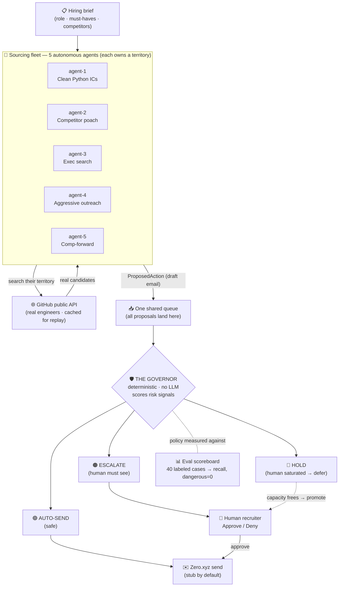
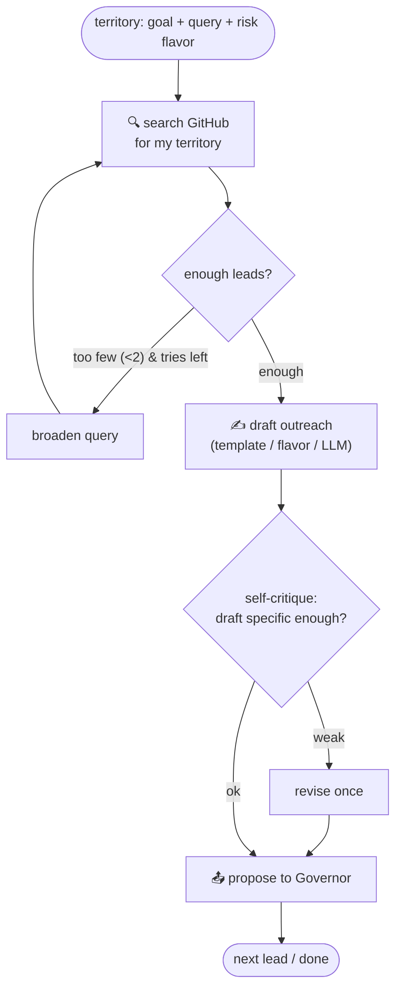
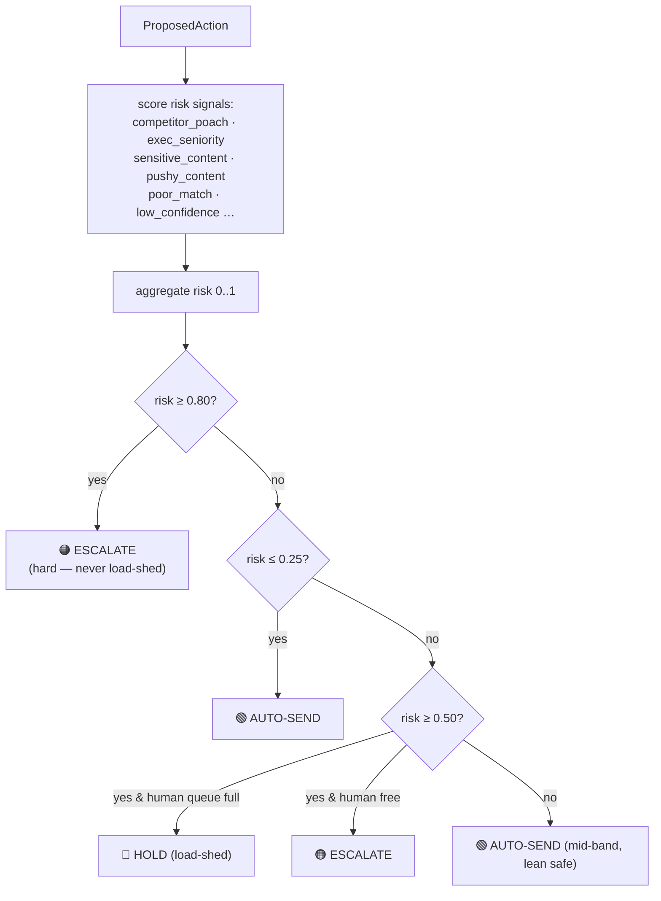
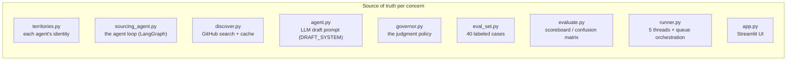
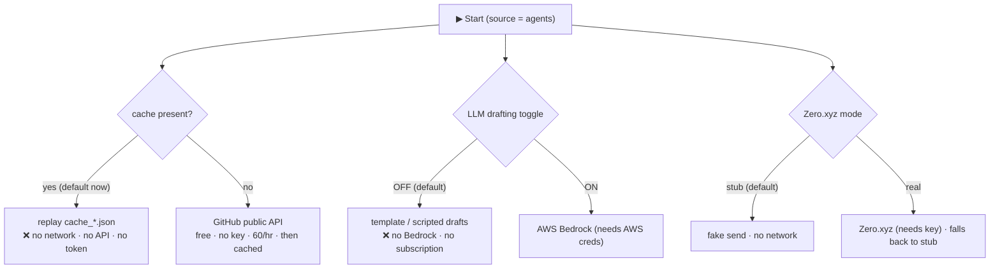

# 🛡️ The Governor — Architecture

How the system flows, end to end. One hiring brief in → real leads sourced → drafted →
**judged by the Governor** → sent / escalated / held → measured against ground truth.

---

## At a glance

```
                       ┌───────────────────────────┐
                       │   📋  HIRING BRIEF          │
                       │   role · must-haves ·      │
                       │   competitor list          │
                       └─────────────┬─────────────┘
                                     │  split into 5 territories
      ┌───────────┬───────────┬──────┴──────┬───────────┬───────────┐
      ▼           ▼           ▼             ▼           ▼
 ┌─────────┐ ┌─────────┐ ┌─────────┐  ┌─────────┐ ┌─────────┐
 │ agent-1 │ │ agent-2 │ │ agent-3 │  │ agent-4 │ │ agent-5 │   5 AUTONOMOUS AGENTS
 │ clean   │ │ compet. │ │ exec    │  │ pushy   │ │ comp-   │   each runs its own loop:
 │ ICs     │ │ poach   │ │ search  │  │ draft   │ │ forward │   search → (broaden?) →
 └────┬────┘ └────┬────┘ └────┬────┘  └────┬────┘ └────┬────┘   draft → (revise?) → propose
      └───────────┴───────────┼────────────┴───────────┘
                              ▼
                   ┌─────────────────────┐
                   │   📥  SHARED QUEUE    │   all proposals land here
                   └──────────┬──────────┘
                              ▼
             ╔═════════════════════════════════╗
             ║   🛡️   THE  GOVERNOR             ║   deterministic · NO LLM
             ║   score risk signals → decide   ║   evaluable · won't flake on stage
             ╚════════════════┬════════════════╝
          ┌──────────────────┼──────────────────┐
          ▼                  ▼                  ▼
    🟢 AUTO-SEND        🟠 ESCALATE         🔵 HOLD
    (low risk)          (human must see)    (human saturated → defer)
          │                  │                  │
          ▼                  ▼                  ▼
    ✉️  Zero.xyz        👤 Human            ↩ back to queue
       (stub)             approve / deny       when capacity frees
          
    ─────────────────────────────────────────────────────────────
    📊  EVAL SCOREBOARD   ·   40 labeled cases
        escalation recall 1.00   ·   0 dangerous auto-sends
```

**Runs fully offline:** candidate search replays a local cache, drafting is templated (no LLM),
sends are stubbed — **no credentials, no network, no env vars required.**

---

## 1. The whole system at a glance



**Read it as:** the agents *propose*, the Governor *decides*, the human sees *only what needs
judgment*, and the scoreboard *proves the decisions are correct*.

---

## 2. What one agent actually does (the loop)

Each of the 5 agents runs this independently, in its own thread, for its own territory.
The **diamonds are real decisions** — that's what makes it an agent loop, not a script.



- **Decision 1** (broaden & re-search) lives as a LangGraph *conditional edge* — `search → search`.
- **Decision 2** (revise a weak draft) fires when a lead has no company / the draft is too thin.
- The **risk flavor** shapes the draft/target so different agents trip different Governor signals.

---

## 3. How the Governor decides (deterministic)



The thresholds and signal weights are the knobs an eval researcher sweeps — all in `governor.py`.

---

## 4. Where everything lives



| Concern | File |
|---|---|
| Each agent's **identity** (territory, query, risk flavor) | `territories.py` |
| The **agent loop** (search → broaden → draft → critique → propose) | `sourcing_agent.py` |
| The **search tool** (GitHub + per-query cache + rate-limit guard) | `discover.py` |
| The **LLM drafting prompt** (only used when Bedrock toggle is ON) | `agent.py` |
| The **Governor** (risk signals, thresholds, load-shedding) | `governor.py` |
| **Ground-truth** eval set + **scoreboard** | `eval_set.py`, `evaluate.py` |
| **Orchestration** (5 threads → 1 queue → Governor) | `runner.py` |
| **UI** | `app.py` |

---

## 5. Runtime & data — what a local run actually uses



**Bottom line for a run right now:** it uses **cached search data from the earlier real run** —
fully **offline**, **no API keys, no AWS/Bedrock, no Claude subscription, no tokens**. It's a
self-contained demo. The only ways to touch a paid/live service are flipping the LLM toggle
(Bedrock) or Zero mode to real — neither is needed.
</content>
